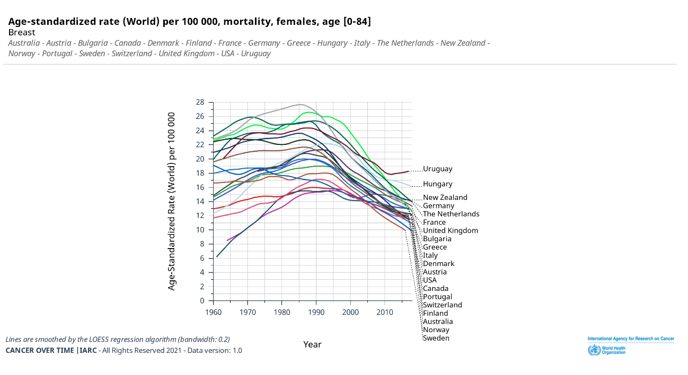
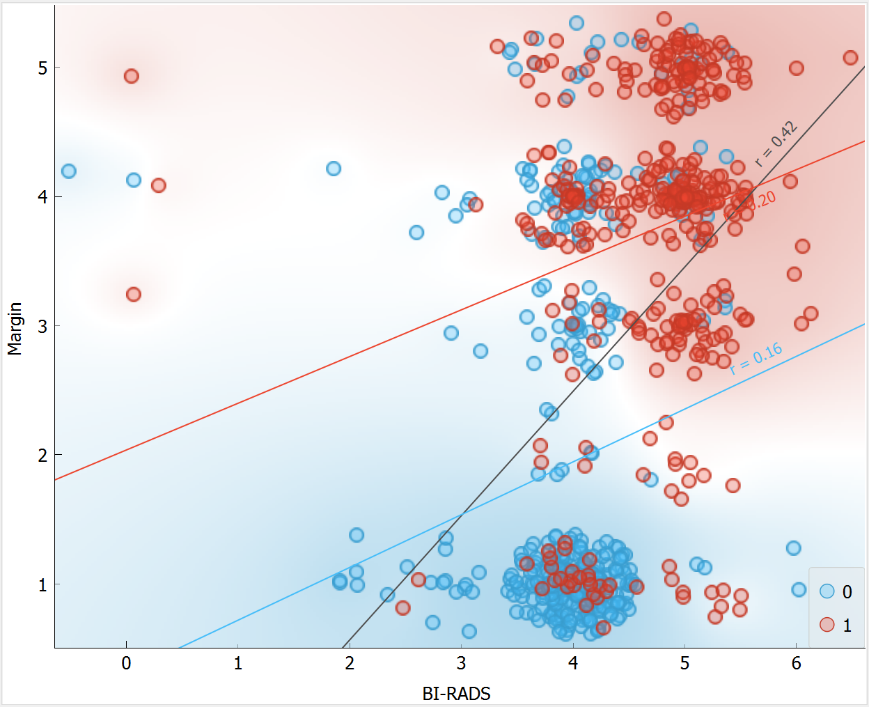
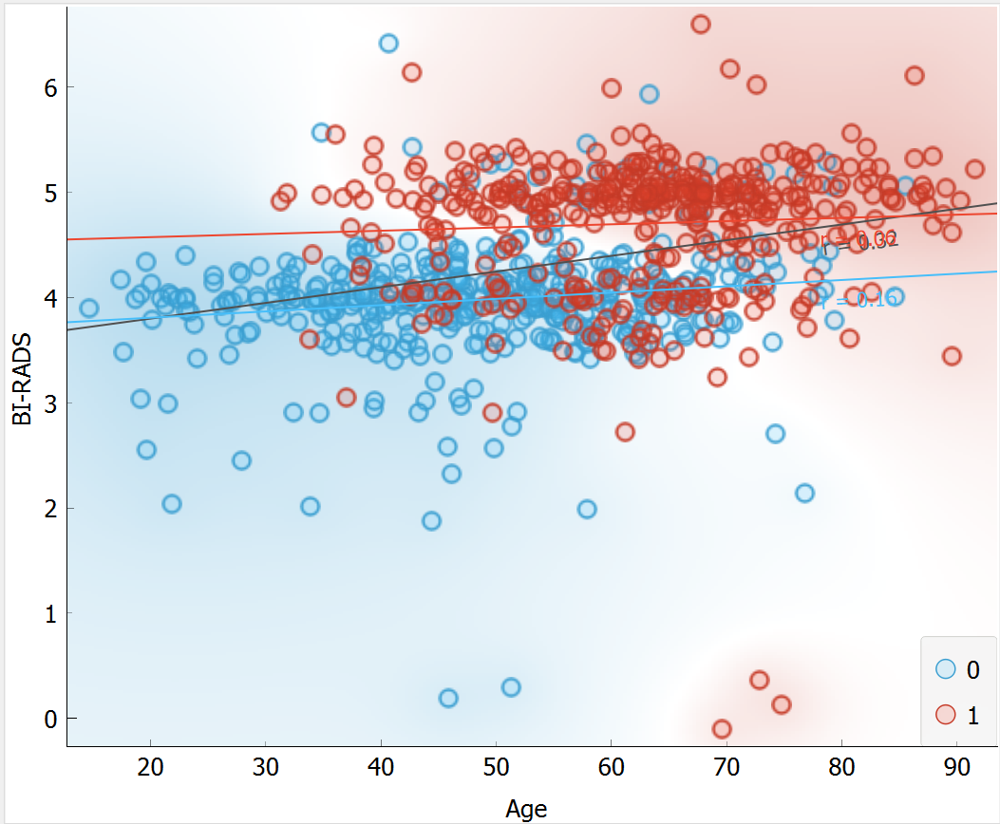
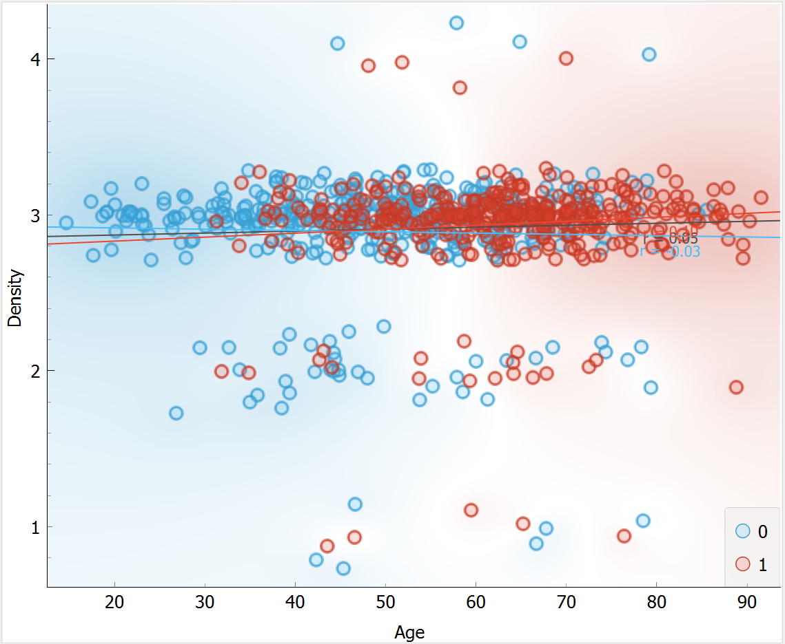

# Computer-Aided Diagnosis of Breast Cancer Based on Age, BI-RADS Score and Mammographic Masses to Improve Healthcare Screening

## Table of Contents 

1. [Introduction](#1-introduction)   
  1.1 [Mammography and BI-RADS Scoring](#11-mammography-and-bi-rads-scoring)   
  1.2 [Challenges in Mammography Screening](#12-challenges-in-mammography-screening)   
  1.3 [Use of Machine Learning and Mammography Masses Dataset](#13-use-of-machine-learning-and-mammography-masses-dataset)   
  1.4 [Feature Space](#14-feature-space)    

2. Methodology  
  2.1 Data Cleansing   
  2.2 Feature Pre-processing  
  2.3 Model Selection: K-nearest neighbour   
  2.4 Hyper-parameter Optimisation: KNN  
  2.5 Model Selection: Random Forest  
  2.6 Hyper-parameter Optimisation: Random Forest  
  2.7 Model Evaluation Metrics
   
3. Results  
  3.1 KNN  
  3.2 Random Forest  
  3.3 RF and KNN Sensitivity Analysis   

4. Discussion and Conclusion

5. References

6. Appendices

## 1. Introduction 
It is estimated that breast cancer is the most common cancer, with the highest incidence, mortality, and prevalence in women, worldwide [1]. Since 1985 research and treatments have rapidly evolved, alongside the introduction of mass screening. Early detection has played a vital role in catching breast cancer in-situ stage 0 or localised stage 1. Currently, 99% of breast cancer patients survive for more than five years if discovered during stages 0 – 1. The drastically lowered mortality rates from the late 1980s are portrayed in Figure 1; this was partly due to the adaption of mammography screening [2][3].

**Figure 1.** Female mortality rate of breast cancer in countries with available data from 1960 to 2018 [2]. 

### 1.1 Mammography and BI-RADS Scoring
Mammography screening uses an x-ray imaging modality held every two to three years between 47 – 74 years old, varying by country [4][5]. The imaging data is either categorised using Breast Imaging-Reporting and Data System (BI-RADS) (Table 1) released by the American College of Radiology, where 1 is normal, and 6 refers to proven malignancy; or the UK five-point scoring system by the Royal College of Radiologists states a score of 1 is benign whereas 5 is malignant [6][7]. 

| **Table 1.** BI-RADs assessment categories for mammography, based upon American College of Radiology [6]. |
| --- |

### 1.2 Challenges in Mammography Screening
Despite the great benefits of screening for breast cancer survival, challenges surrounding false positives (FP) have significant implications on healthcare resources and the ethics of screening. The rate of FP results has risen due to the increase in screening. Unfortunately, mammography is highly sensitive, and the varied clinical decision-making between doctors and the “better safer than sorry approach” has decreased the true positive rate. 

The consequences of FPs are overdiagnosis and overtreatment. Further diagnostic tests lead to extra time spent, use of hospital personnel and unnecessary expenses to the healthcare system [8]. More importantly, with ethical regards, informing the patient of a FP may lead to distress, especially during the waiting time for further diagnosis, or being informed of in-actionable findings, i.e., breast cancer stage 0, may also increase anxiety. Further testing may be invasive; for example, unnecessary breast biopsies are causing more harm than good.

### 1.3 Use of Machine Learning and Mammography Masses Dataset
The aim is to utilise machine learning algorithms to improve differentiation between benign and malignant breast cancer, thus reducing false positives. The “Mammographic masses” dataset was obtained from the UCI Machine Learning Repository [9]. The dataset and Orange: Data Mining Toolbox in Python will be used to construct prediction algorithms based on supervised learning approaches of random forest and KNN.   

The dataset originates from the Institute of Radiology of University Erlangen-Nuremberg. The data was collected between 2003 and 2006 and included 961 instances comprising 516 benign and 445 malignant masses. This multivariate dataset consists of 5 features (BI-RADS score, shape, margin, density, and Age) and 1 class (severity as benign or malignant), portrayed in Table 2. The dataset had all features and classes assigned a numerical value; this will aid the algorithm. The descriptive statistics (Appendix 1) revealed that density mass had the most missing data. BI-RADS range and a maximum of ‘55’ was an outlier strongly suggestive of a typo; this will be removed during the data cleansing. Overall, there is only a slight deviation in the mean and median; therefore, the data has a relatively normal distribution. 

| **Table 2.** Information box on features and classes, assigned values and amount of missing data of the Mammography masses dataset. |
| --- |

### 1.4 Feature Space
Orange shows BI-RADS against margin shape and density provided the most informative projections. An example of BI-RADS vs Margin is portrayed in Figure 2a, showing a positive correlation, and a boundary line can be defined between the features. Secondly, BI-RADS vs Age was important to look at (Figure 2b), as BI-RADS scoring includes margin, shape and density masses and summarises the overall relationship of age with the remaining features. Also to note, the outliers showing BI-RADS scores of 6 are biopsy-confirmed malignant cases; therefore, the two benign (blue circles) are incorrect; the remaining BI-RADS score = 6 may contribute to data leakage. Highlighting Density vs other features showed density did not provide much information (Figure 2c), as it mostly lay in a single plane; density may be removed during feature selection.

     

<b>Figure 2a.</b> BI-RADS vs Margin feature space created in Orange toolbox
   
    

  

<b>Figure 2b.</b> Age vs BI-RADS feature space created in Orange toolbox.

  

<b>Figure 2c.</b> Age vs Density feature space created in Orange toolbox.

## 2. Methodology

### 2.1 Data Cleansing 

### 2.2 Feature Pre-processing

### 2.3 Model Selection: K-nearest neighbour 

### 2.4 Hyper-parameter Optimisation: KNN

### 2.5 Model Selection: Random Forest

### 2.6 Hyper-parameter Optimisation: Random Forest

### 2.7 Model Evaluation Metrics

## 3. Results

### 3.1 KNN

### 3.2 Random Forest

### 3.3 RF and KNN Sensitivity Analysis 

## 4. Discussion and Conclusion

## 5. References
https://archive.ics.uci.edu/dataset/161/mammographic+mass

## 6. Appendices

