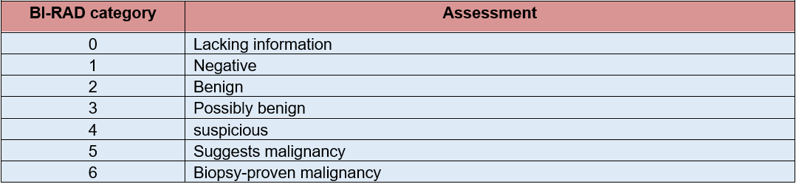
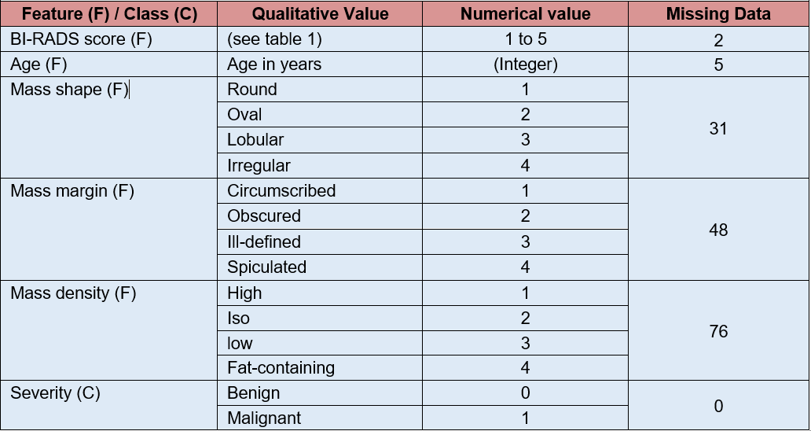
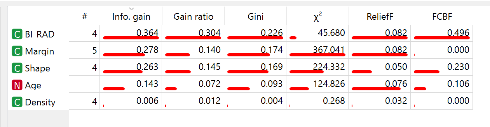
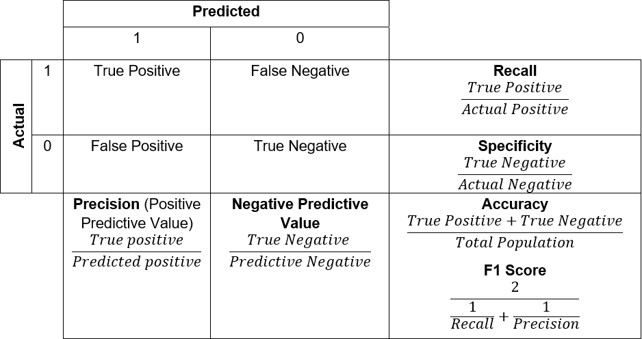
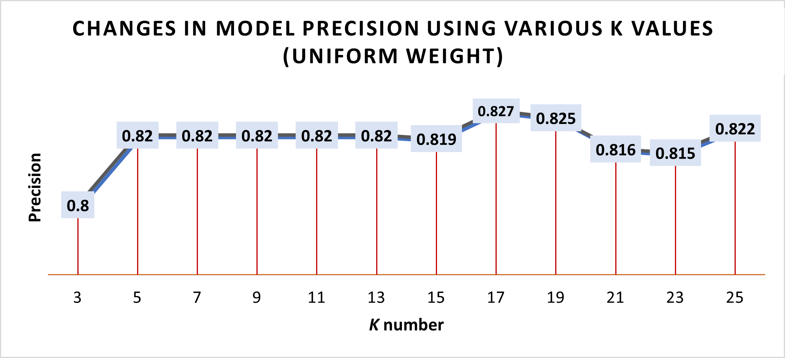
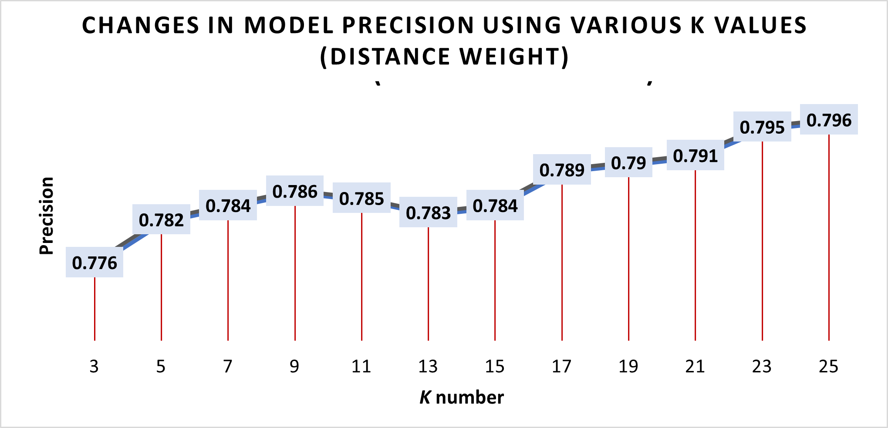
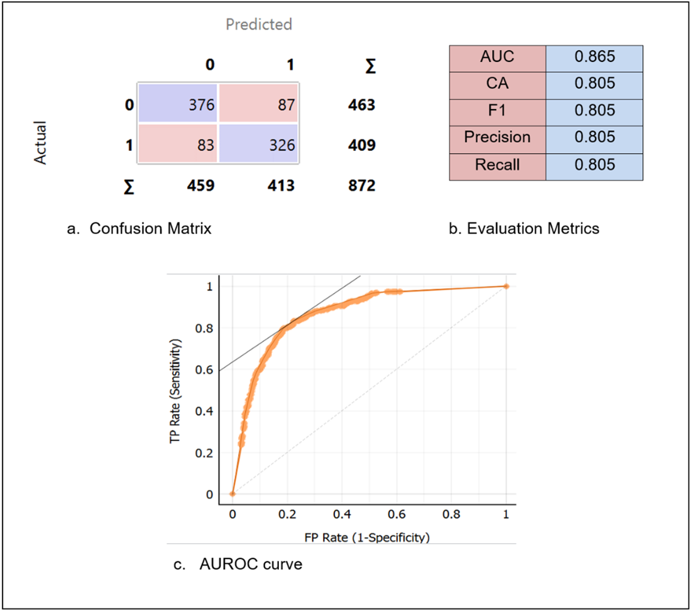
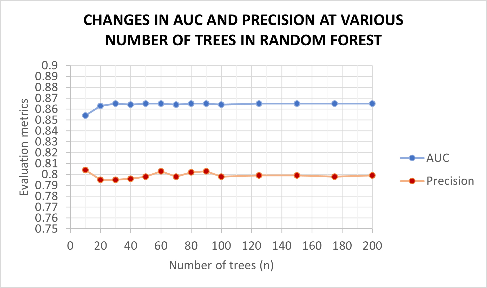
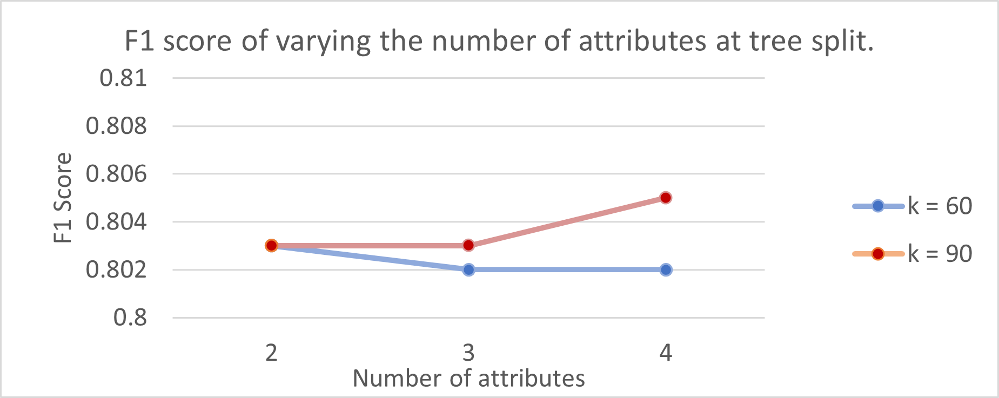
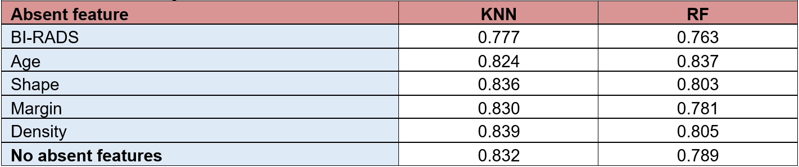

# Computer-Aided Diagnosis of Breast Cancer Based on Age, BI-RADS Score and Mammographic Masses to Improve Healthcare Screening

## Table of Contents 

1. [Introduction](#1-introduction)   
    1.1 [Mammography and BI-RADS Scoring](#11-mammography-and-bi-rads-scoring)   
    1.2 [Challenges in Mammography Screening](#12-challenges-in-mammography-screening)   
    1.3 [Use of Machine Learning and Mammography Masses Dataset](#13-use-of-machine-learning-and-mammography-masses-dataset)   
    1.4 [Feature Space](#14-feature-space)    

2. [Methodology](#2-methodology)  
    2.1 [Data Cleansing](#21-data-cleansing)   
    2.2 [Feature Pre-processing](#22-feature-pre-processing)  
    2.3 [Model Selection: K-nearest neighbour](#23-model-selection-k-nearest-neighbour)   
    2.4 [Hyper-parameter Optimisation: KNN](#24-hyper-parameter-optimisation-knn)  
    2.5 [Model Selection: Random Forest](#25-model-selection-random-forest)  
    2.6 [Hyper-parameter Optimisation: Random Forest](#26-hyper-parameter-optimisation-random-forest)  
    2.7 [Model Evaluation Metrics](#27-model-evaluation-metrics)
   
3. [Results](#3-results)  
    3.1 [KNN](#31-knn)  
    3.2 [Random Forest](#33-rf-and-knn-sensitivity-analysis)  
    3.3 [RF and KNN Sensitivity Analysis](#33-rf-and-knn-sensitivity-analysis)   

4. [Discussion and Conclusion](#4-discussion-and-conclusion)

5. [References](#5-references)

6. [Appendices](#6-appendices)

## 1. Introduction 
It is estimated that breast cancer is the most common cancer, with the highest incidence, mortality, and prevalence in women, worldwide [1]. Since 1985 research and treatments have rapidly evolved, alongside the introduction of mass screening. Early detection has played a vital role in catching breast cancer in-situ stage 0 or localised stage 1. Currently, 99% of breast cancer patients survive for more than five years if discovered during stages 0 – 1. The drastically lowered mortality rates from the late 1980s are portrayed in *Figure 1*; this was partly due to the adaption of mammography screening [2][3].

**Figure 1.** Female mortality rate of breast cancer in countries with available data from 1960 to 2018 [2]. 

### 1.1 Mammography and BI-RADS Scoring
Mammography screening uses an x-ray imaging modality held every two to three years between 47 – 74 years old, varying by country [4][5]. The imaging data is either categorised using the Breast Imaging-Reporting and Data System (BI-RADS) (Table 1) released by the American College of Radiology, where 1 is normal, and 6 refers to proven malignancy; or the UK five-point scoring system by the Royal College of Radiologists states a score of 1 is benign whereas 5 is malignant [6][7]. 

| **Table 1.** BI-RADs assessment categories for mammography, based upon the American College of Radiology [6]. |
| --- |

### 1.2 Challenges in Mammography Screening
Despite the great benefits of screening for breast cancer survival, challenges surrounding false positives (FP) have significant implications on healthcare resources and the ethics of screening. The rate of FP results has risen due to the increase in screening. Unfortunately, mammography is highly sensitive, and the varied clinical decision-making between doctors and the “better safer than sorry approach” has decreased the true positive rate. 

The consequences of FPs are overdiagnosis and overtreatment. Further diagnostic tests lead to extra time spent, use of hospital personnel and unnecessary expenses to the healthcare system [8]. More importantly, with ethical regards, informing the patient of a FP may lead to distress, especially during the waiting time for further diagnosis, or being informed of in-actionable findings, i.e., breast cancer stage 0, may also increase anxiety. Further testing may be invasive; for example, unnecessary breast biopsies are causing more harm than good.

### 1.3 Use of Machine Learning and Mammography Masses Dataset
The aim is to utilise machine learning algorithms to improve differentiation between benign and malignant breast cancer, thus reducing false positives. The “Mammographic masses” dataset was obtained from the UCI Machine Learning Repository [9]. The dataset and Orange: Data Mining Toolbox in Python will be used to construct prediction algorithms based on supervised learning approaches of random forest and KNN.   

The dataset originates from the Institute of Radiology of University Erlangen-Nuremberg. The data was collected between 2003 and 2006 and included 961 instances comprising 516 benign and 445 malignant masses. This multivariate dataset consists of 5 features (BI-RADS score, shape, margin, density, and Age) and 1 class (severity as benign or malignant), portrayed in *Table 2*. The dataset had all features and classes assigned a numerical value; this will aid the algorithm. The descriptive statistics (Appendix 1) revealed that density mass had the most missing data. BI-RADS range and a maximum of ‘55’ was an outlier strongly suggestive of a typo; this will be removed during the data cleansing. Overall, there is only a slight deviation in the mean and median; therefore, the data has a relatively normal distribution. 

| **Table 2.** Information box on features and classes, assigned values and amount of missing data of the Mammography masses dataset. |
| --- |

### 1.4 Feature Space
Orange shows BI-RADS against margin shape and density provided the most informative projections. An example of BI-RADS vs Margin is portrayed in *Figure 2a*, showing a positive correlation, and a boundary line can be defined between the features. Secondly, BI-RADS vs Age was important to look at (Figure 2b), as BI-RADS scoring includes margin, shape and density masses and summarises the overall relationship of age with the remaining features. Also to note, the outliers showing BI-RADS scores of 6 are biopsy-confirmed malignant cases; therefore, the two benign (blue circles) are incorrect; the remaining BI-RADS score = 6 may contribute to data leakage. Highlighting Density vs other features showed density did not provide much information (Figure 2c), as it mostly lay in a single plane; density may be removed during feature selection.

 <b>Figure 2a.</b> BI-RADS vs Margin feature space created in Orange toolbox.
   

    

 <b>Figure 2b.</b> Age vs BI-RADS feature space created in Orange toolbox.

 <b>Figure 2c.</b> Age vs Density feature space created in Orange toolbox.

## 2. Methodology    
Orange toolbox `.ows` file showing the methodology pipeline has been separately attached.    

### 2.1 Data Cleansing     
Data pre-processing started with the conversion of the dataset into .xls format. Data was split into feature columns, and a row at the top with feature names was added to differentiate the columns. Data cleansing involved replacing 16 instances with BI-RAD values of 0 and 6 with a “?”; 0 meant insufficient data, and 6 conferred to a biopsy-confirmed tumour. Secondly, instance 341 in feature column BI-RAD contained a typo of “55”; this was replaced with 5.     

On Orange, instances with missing values were removed using the impute function. The categorical nature of the majority of our features does not allow for mean or regressive substitution, nor any other approaches to reserve the dataset, e.g., replacing values with K-nearest neighbour, as this adds bias and inaccuracies to the data and creates a layer of uncertainty when evaluating the model performance. Consequently, listwise deletion does not have a significant impact as the dataset is moderately large; 816 instances remain out of 961.    

### 2.2 Feature Pre-processing
For feature selection, all features were ranked (Table 3), focusing on information gain and gain ratio. Density shows insignificant contribution continually throughout all rankings; therefore, it will be removed. Using the pre-process function in Orange, features were fixed to ‘four’, and scoring was set to ‘information gain’; this automatically removed density. Initially, there was doubt over the importance of including both BI-RADS and margin/shape/density due to all three already being part of the BI-RADS score under the mass section. However, the inclusion of margin/shape/density increased the weight of these features, along with BI-RADS involving calcifications, symmetry, and other associated features. There was no feature construction as it was not necessary for our dataset. Further pre-processing involved feature standardisation, set at ‘standardise to µ = 0 and σ2 = 1’, this is especially important as the age feature ranges from 18 to 95, whereas the rest go up to 5. 
| **Table 3.** Feature ranking using various metrics on Orange toolbox shows BI-RADS (highest) to density (lowest). |
| --- |

### 2.3 Model Selection: K-nearest neighbour     
K nearest neighbour (KNN) is a lazy learner algorithm that does not rely on learning the relationships within the data to create a discriminatory function; instead, it focuses on the current state of the data set and assigns a class based on the unclassified data point’s nearest neighbouring data points and casts a majority vote on which class to assign [10]. The KKN algorithm pseudocode is as follows in *Box 1*.     

 | Box 1.  KNN algorthim pseudocode. |
 | --- |
 | <b>Start</b> Load class-labelled reference dataset Manually assign odd K value where K is the number of closest neighbouring points Manually assign distance metric: &emsp;&emsp;If the distance metric is Euclidean, then use the formula:  $$√(\sum_{i=1}^k (x_i-y_i )^2 )$$  &emsp;&emsp;Else distance metric is Manhattan, then use the formula:  $$\sum_{i=1}^k \|x_i-y_i \|$$   &emsp;&emsp;Else if the distance metric is Minkowski, then use the formula:  $$( \sum_{i=1}^k (\|x_1-y_i \|)^q )^\frac{1}{q}$$   Calculate distances from all reference point to new data point using chosen metric  Sort from the smallest distance at the top to the largest distance at the bottom  Highlight top <i>K</i> (number manually assigned) points (closest to new data point)  Find class assigned to top <em>K</em> reference data points, and assign weighting :  &emsp;&emsp;If uniform weighting, then all points hold equal weight to class &emsp;&emsp;Else if distance weighting, then the class of nearest point holds more weight.   Conduct class voting  Output results <b>End</b> |

### 2.4 Hyper-parameter Optimisation: KNN    
The three hyperparameters to consider in KNN are the distance metric, *K* number and weight. 
The most popular metric, Euclidean distance, was chosen because it calculates the direct distance to each point and, therefore, can be used in any direction in space without dimension limitations.     

When choosing a *K* number, a systematic approach was used with a Euclidean distance of uniform weighting, where odd *K* values were input from 3 to 25 and results with evaluation metrics would be tabulated. A similar systematic approach was used for choosing weight, where uniform weighting was replaced with distance-based weighting

### 2.5 Model Selection: Random Forest    
The second model that was used is Random forest (RF). RF is an ensemble method based upon using multiple decision trees that each output a class based upon the input data. A voting mechanism is used to decide the final output class [11]. The random forest algorithm pseudocode is as follows in *Box 2*.

| Box 2. Random Forest algorithm pseudocode. |
| --- |
|<b>Start</b> Load labelled dataset = D   All set of features = F  <dd> Manually assign the number of trees, where trees = N <dd>  For all trees 1 to N, using the bootstrap method:  &emsp;&emsp;take a small randomly selected sample from D, labelled <i>d</i>  &emsp;&emsp;and a random set number of features ( <i>f</i> ) that are less than F Using <i>f</i> set of features, calculate the root node using one best-split approach Create daughter nodes where best split approaches are: &emsp;&emsp;Gini impurity (likely used in Orange toolkit) &emsp;&emsp;Entropy  &emsp;&emsp;Classification error <dd>Once N trees are created with their daughter nodes, a random forest has been created<dd>  Using each decision tree, predict the class label &emsp;&emsp;Where class label counts as a single vote  Count all votes from each tree  Output class with the majority vote <b>End</b> |
 
### 2.6 Hyper-parameter Optimisation: Random Forest    
The main hyperparameter to adjust is the number of trees, setting attribute numbers on splits, and limiting tree growth. To decide the optimal number of trees (n), n was input from 10 to 100 at intervals of 10 and 125 to 200 at intervals of 25. The training was set as replicable, and the attribute number was left unchecked. The results and evaluation metrics would be tabulated. Various attribute numbers will be tested against the optimal number of trees chosen in the previous step to define the optimal number of attributes.

### 2.7 Model Evaluation Metrics
Orange toolbox contains a variety of evaluation metrics. For a classification task, confusion matrix, precision, recall, F1 score, and AUROC are useful evaluators (Figure 3). The ‘Test and Score’, ‘Confusion Matrix’, and ‘ROC Analysis’ widgets will be attached to the learning models. The F1 score will be used to combine precision and recall; as individuals, they are not great metrics.
    
 <b>Figure 3.</b> Confusion matrix and derivation of recall, specificity, precision/positive predicted value, negative predictive value, accuracy (CA) and F1 score.

## 3. Results

### 3.1 KNN
The K number and associated evaluation metrics were recorded in a table (Appendix 2a). The focus was on obtaining a minimal error rate (1 – precision); Figure 4a shows the k values plotted against precision; other evaluation metrics were used as support. K = 9 was chosen due to the least error and highest overall evaluation metrics. Similarly, evaluation metrics were tabulated after changing to distance weighting (Appendix 2b). Figure 4b presented precision against the various K values and showed an underperformance on all evaluation metrics compared to uniform weighting.
The finalised hyperparameters are K = 9 using Euclidean distance of uniform weight. 

 <b>Figure 4a</b>. Hyperparameter tuning of K number and the associated model precision. Euclidean distance of uniform weight.    

 <b>Figure 4b.</b> Hyperparameter tuning of K number and the associated model precision. Euclidean distance of distance-based weight.

The stratified 10-fold cross-validation on the optimised hyperparameters of KNN gave the following confusion matrix and evaluation metrics, shown in Figure 5. However, focusing on AUROC as the primary metric and other metrics as secondary, then K = 21 provides better results than k=9, 0.898 vs 0.891, respectively (Figure 5d). However, F1 and CA are the main focus due to their robustness in model evaluation.    

 <b>Figure 5.</b> K-nearest neighbour model evaluation. a) Confusion matrix when k=9. b) 5 evaluation metrics when k=9. C) AUROC curve when k=9 d) AUROC curve when k=21. Abbreviations: AUC, Area under the curve; AUROC, area under the receiver operating characteristic; CA, accuracy.

### 3.2 Random Forest
The AUC and precision were plotted against the number of trees (Figure 6a), where the chosen optimal n was 60 and 90 trees. The attribute number at each split was tested for n = 60 and n = 90, where the number of attributes = 4 of n = 90 yielded favourable results (Figure 6b), although overall differences in model performance were minute. 

 <b>Figure 6a.</b> Changes in AUC and precision at various numbers of trees in random forest. Highest precision was seen in k= 60 and k=90. Abbreviations: AUC, Area under the curve.

 <b>Figure 6b.</b> Changes in F1 score for attribute number at tree split set to 2, 3 and 4. Highest precision was seen in k=90 using 4 attributes at tree split. 

The stratified 10-fold cross-validation of n = 90 and attribute at each split = 4  of RF gave the following model performance (Figure 6). It is noted that RF performed worse than KNN with an F1 (and accuracy) of 0.805 vs 0.839, respectively. 

### 3.3 RF and KNN Sensitivity Analysis 
A sensitivity analysis was carried out to reduce the uncertainty surrounding both models (Table 4). This was done by removing one of the features within the dataset whilst keeping the others, giving insight into the importance of certain features. Removing BI-RADS for both models drastically reduced the performance, demonstrating that this is an excellent indicator for predicting breast cancer and the model mainly relied on this. For both models, the individual exclusion of shape improved the score, this was by a significant margin for RF but only a small increase in KNN. This may indicate that Shape data is superfluous to the prediction or may be detrimental; further research would be required to confirm. When removing the Margin feature, both algorithms had a minimal decrease in score. Interestingly, the removal of Age in the RF model improved the F1 score, whereas the K-NN model worsened. Density was removed in the pre-processing stage as it was assumed as insignificant in cancer detection and may reduce model performance; this has been proved by this analysis.     

|Table 4.  Feature sensitivity analysis of K nearest neighbour and Random Forest. Removal of individual features and recording F1 score. |
| --- |

Overall, BI-RADS and Margin are key factors in prediction, whereas Density and Shape are not. The case for Age cannot be ascertained as it improves one model whilst deteriorating the other. However, the insight given from this report can only be validated by cross-checking with other datasets, as the dataset used is relatively small and could contain biases. It should be noted that the RF method does create a new forest when altering the data (despite setting the forest as replicable), thus leading to minor deviations in prediction capabilities, nevertheless still included within this sensitivity analysis.

## 4. Discussion and Conclusion
The mammographic masses (MM) dataset has been utilised in designing other machine learning models; one research group implemented a Naïve Bayes model on various datasets, including MM [12]. Naïve Bayes performed with 0.90 AUC compared to 0.891 (KNN) and 0.865 (RF). Unfortunately, other metrics were not provided for further comparison. Another research group employed artificial neural networks (ANN) and decision trees in which decision trees performed marginally worse, AUC  of  0.88 vs 0.87, respectively [13]. The KNN model performed better than both; however, the RF only performed better than the decision trees. Both studies stated that further testing and validation was required.       

Although RF and KNN did not perform as well as expected, many other models performed well, and with better-optimised parameters could improve diagnostic accuracy. For example, using Orange to implement Naïve Bayes on the pre-processed data provided AUC=0.902 and F1=0.835; with little effort in hyperparameter optimisation, ANN provided AUC=0.899, this could be drastically improved with effort and could potentially perform better than KNN.     

To further improve the methodology, a separate dataset would help reduce uncertainties. The MM dataset was from Germany; to ensure my model works equally well universally, it would need to be deployed on datasets from other countries. Furthermore, due to the retrospective nature of the MM dataset, to validate the models' clinical use, the models would need to run on real-time data; this would also expose whether the models were over-fitted.     

Overall, the computer-aided diagnosis approach can improve breast cancer screening by reducing the problem of FP rates. Realistically, the models will be used in conjunction with a doctor’s expertise, who can consider complete case history to decide further action after screening.    

The RF and KNN models performed at 0.839 and 0.805 F1 scores. This was not expected for RF as it is tailored towards classification predictions. It may perform better with a larger dataset and better optimisation. Whereas K-NN, which performed better, will have too high a computational cost with a large dataset to be used clinically. Testing these methods against another database will allow us to determine if these results are accurate and could provide ways to improve the accuracy of both models. There are many other robust models for diagnosing breast cancer, such as ANN and Naïve Bayes, which need to be further validated and hold potential for clinical application. 

## 5. References

1. Global Cancer Observatory. Cancer Over Time [Internet]. International Agency for Research on Cancer. World Health Organisation; 2021 [cited 2021 Dec 3]. Available from: https://gco.iarc.fr/overtime/en/dataviz/trends?multiple_populations=1&sexes=2&cancers=14&types=1&populations=27600_75200_82600_84000_4000_3600_10000_12400_20800_24600_25000_34800_30000_38000_52800_55400_57800_62000_75600_85800&key=asr&age_end=16&group_populations=0&years=1960_2018&scale=linear&min_zero=1&num_path=2&smoothing=20   
2. Global Cancer Observatory. Cancer today [Internet]. International Agency for Research on Cancer. World Health Organisation; 2020 [cited 2021 Dec 3]. Available from: https://gco.iarc.fr/today/online-analysis-pie   
  3. SEER. Female Breast Cancer - Cancer Stat Facts [Internet]. National Cancer Institute. 2018. Available from: https://seer.cancer.gov/statfacts/html/breast.html 
4. NHS. When you’ll Be Invited for Breast Screening and Who Should Go [Internet]. National Health Service. 2021 [cited 2021 Dec 3]. Available from: https://www.nhs.uk/conditions/breast-screening-mammogram/when-youll-be-invited-and-who-should-go/   
5. CDC. What Is Breast Cancer screening? [Internet]. Centers for Disease Control and Prevention. 2019 [cited 2021 Dec 3]. Available from: https://www.cdc.gov/cancer/breast/basic_info/screening.htm   
6. American College Of Radiology. ACR BI-RADS Atlas: Breast Imaging and Reporting Data System. 5th ed. Reston, Va: American College of Radiology; 2013.  
7. Maxwell AJ, Ridley NT, Rubin G, Wallis MG, Gilbert FJ, Michell MJ. The Royal College of Radiologists Breast Group Breast Imaging Classification. Clinical Radiology [Internet]. 2009 Jun [cited 2021 Dec 4];64(6):624–7. Available from: https://doi.org/10.1016/j.crad.2009.01.010   
8. Ong M-S, Mandl KD. National Expenditure for False-Positive Mammograms and Breast Cancer Overdiagnoses Estimated at $4 Billion a Year. Health Affairs [Internet]. 2015 Apr [cited 2021 Dec 4];34(4):576–83. Available from: https://doi.org/10.1377/hlthaff.2014.1087   
9. Elter M. Mammographic Mass [Internet]. UCI Machine Learning Repository. 2007 [cited 2021 Dec 4]. Available from: https://archive.ics.uci.edu/dataset/161/mammographic+mass     
10. Urso A, Fiannaca A, La Rosa M, Ravì V, Rizzo R. Data Mining: Prediction Methods. Encyclopedia of Bioinformatics and Computational Biology [Internet]. 2019 [cited 2021 Dec 3];1:413–30. Available from: https://doi.org/10.1016/b978-0-12-809633-8.20462-7 
11. Zucco C. Multiple Learners Combination: Bagging. Encyclopedia of Bioinformatics and Computational Biology [Internet]. 2019 [cited 2021 Dec 7];1:525–30. Available from: https://doi.org/10.1016/B978-0-12-809633-8.20345-2 
12. Benndorf M, Burnside ES, Herda C, Langer M, Kotter E. External validation of a publicly available computer assisted diagnostic tool for mammographic mass lesions with two high prevalence research datasets. Medical Physics [Internet]. 2015 Jul 31 [cited 2021 Dec 13];42(8):4987–96. Available from: https://doi.org/10.1118/1.4927260     
13. Elter M, Schulz-Wendtland R, Wittenberg T. The prediction of breast cancer biopsy outcomes using two CAD approaches that both emphasize an intelligible decision process. Medical Physics [Internet]. 2007 Oct 15 [cited 2021 Dec 14];34(11):4164–72. Available from: https://doi.org/10.1118/1.2786864

## 6. Appendices
 
<b>Appendix 1:</b>  Mammography mass dataset descriptive statistics of 6 attributes ( 5 features and 1 class).    

|BI-RADS	|Age|	Shape|	Margin|	Density	Severity|
| :---: | :---: | :---: | :---: | :---: |
|Mean	|4.348279458|	55.4874477|	2.721505376|	2.796276013|	2.910734463|	0.4625|
|Standard Error|	0.057577088|	0.468320899|	0.040752751|	0.051845092|	0.012788483|	0.016100368|
|Median|	4|	57|	3|	3|	3|	0|
|Mode|	4|	59|	4|	1|	3|	0|
|Standard Deviation|	1.783031438|	14.48013079|	1.242791873|	1.566545583|	0.380443928|	0.498851653|
|Sample Variance|	3.179201108|	209.6741878|	1.544531639|	2.454065064|	0.144737582|	0.248852972|
|Kurtosis|	681.3105153|	-0.311221372|	-1.604674941|	-1.631353192|	11.71228349|	-1.981434156|
|Skewness|	23.87678094|	-0.207192478|	-0.215858944|	-0.038992468|	-2.884805091|	0.15065917|
|Range|	55|	78|	3|	4|	3|	1|
|Minimum|	0|	18|	1|	1|	1|	0|
|Maximum|	55|	96|	4|	5|	4|	1|
|Count|	959|	956|	930|	913|	885|	960|

 
<b>Appendix 2a:</b> Evaluation metrics data (from Orange toolkit) of K values ranging from 3 to 25 using Euclidean Distance of uniform weight.

|KNN Uniform Weight|	AUC|	CA|	F1|	Precision|	Recall|
| :---: | :---: | :---: | :---: | :---: | :---: |
|3|	0.85|	0.807|	0.807|	0.807|	0.807|
|5|	0.877|	0.83|	0.83|	0.83|	0.83|
|7|	0.885|	0.837|	0.837|	0.837|	0.837|
|9|	0.891|	0.839|	0.839|	0.839|	0.839|
|11|	0.896|	0.836|	0.836|	0.836|	0.836|
|13|	0.897|	0.831|	0.831|	0.831|	0.831|
|15|	0.898|	0.827|	0.827|	0.827|	0.827|
|17|	0.898|	0.826|	0.826|	0.826|	0.826|
|19|	0.896|	0.836|	0.836|	0.836|	0.836|
|21|	0.898|	0.837|	0.837|	0.837|	0.837|
|23|	0.898|	0.837|	0.837|	0.837|	0.837|
|25|	0.896|	0.835|	0.835|	0.835|	0.835|

 
<b>Appendix 2b:</b> Evaluation metrics data (from Orange toolkit) of K values ranging from 3 to 25 using Euclidean Distance of distance-based weight.  

|KNN Distance Weight|	AUC|	CA|	F1|	Precision|	Recall|
| :---: | :---: | :---: | :---: | :---: | :---: |
|3|	0.829|	0.799|	0.799|	0.799|	0.799|
|5|	0.835|	0.8|	0.8|	0.801|	0.8|
|7|	0.838|	0.804|	0.803|	0.804|	0.804|
|9|	0.838|	0.808|	0.808|	0.809|	0.808|
|11|	0.838|	0.812|	0.811|	0.812|	0.812|
|13|	0.839|	0.811|	0.81|	0.811|	0.811|
|15|	0.839|	0.813|	0.813|	0.814|	0.813|
|17|	0.839|	0.813|	0.813|	0.814|	0.813|
|19|	0.838|	0.811|	0.81|	0.811|	0.811|
|21|	0.839|	0.81|	0.809|	0.81|	0.81|
|23|	0.839|	0.81|	0.809|	0.81|	0.81|
|25|	0.839|	0.811|	0.81|	0.812|	0.811|

     
<b>Appendix 3a:</b>  Evaluation metrics data (from Orange toolkit) of RF values ranging from 10 to 200, set as replicable, number of attributes left unchecked (default settings).     

|RF|	AUC|	CA|	F1|	Precision|	Recall|
| :---: | :---: | :---: | :---: | :---: | :---: |
|10|	0.854|	0.804|	0.804|	0.804|	0.804|
|20|	0.863|	0.795|	0.795|	0.795|	0.795|
|30|	0.865|	0.795|	0.795|	0.795|	0.795|
|40|	0.864|	0.796|	0.796|	0.796|	0.796|
|50|	0.865|	0.798|	0.798|	0.798|	0.798|
|60|	0.865|	0.803|	0.803|	0.803|	0.803|
|70|	0.864|	0.798|	0.798|	0.798|	0.798|
|80|	0.865|	0.802|	0.802|	0.802|	0.802|
|90|	0.865|	0.803|	0.803|	0.803|	0.803|
|100|	0.864|	0.798|	0.798|	0.798|	0.798|
|125|	0.865|	0.799|	0.799|	0.799|	0.799|
|150|	0.865|	0.799|	0.799|	0.799|	0.799|
|175|	0.865|	0.798|	0.798|	0.798|	0.798|
|200|	0.865|	0.799|	0.799|	0.799|	0.799|

     
<b>Appendix 3b:</b> F1 evaluation metric  (from orange toolkit) of the number of attributes considered at tree split. Note that the F1 Score, CA precision, and recall presented the same score.     

|Attributes|	k = 60|	k = 90|
| :---:| :---: | :---: |
|2|	0.803|	0.803|
|3|	0.802|	0.803|
|4|	0.802|	0.805|

